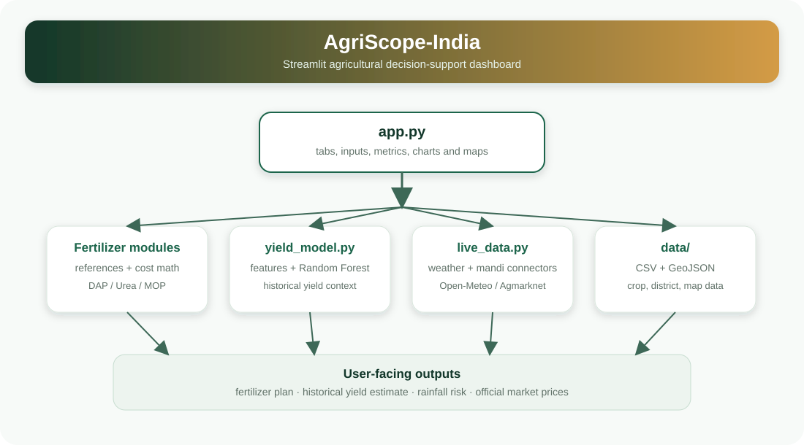
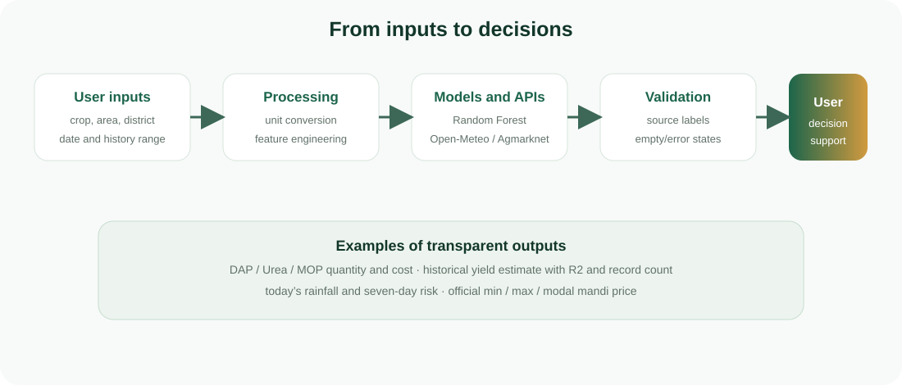

# 🌾 AgriScope-India
## Agricultural Decision-Support Dashboard

### Project Report

**Technologies:** Python, Streamlit, Pandas, Scikit-learn, Plotly and REST APIs  
**Application area:** Crop planning, yield analysis, weather monitoring and
agricultural market information

---

## Abstract

AgriScope-India is a web-based agricultural decision-support application
developed for Odisha. The application brings together crop nutrient
recommendations, fertilizer quantity and cost calculations, historical yield
analysis, a crop-yield regression model, district weather information,
rainfall forecasts and official mandi prices.

The system is implemented in Python using Streamlit. Pandas is used for data
processing, Scikit-learn is used for the yield model, and Plotly is used for
interactive charts and maps. Weather information is obtained from Open-Meteo
and market prices are obtained from Agmarknet 2.0. The application provides
one interface through which users can select a crop, farm area, district and
date range and view the corresponding results.

**Keywords:** agriculture, fertilizer planning, crop yield, weather forecast,
mandi prices, Streamlit, Random Forest

---

## 1. Introduction

Farm decisions depend on several types of information, including fertilizer
requirements, expected weather, historical crop performance and current
market prices. These sources are often separate and may be difficult to use
together. AgriScope-India combines them in a single interactive dashboard.

The application is intended to support comparison and planning. Fertilizer
quantities and costs are calculated from stored crop recommendations. Yield
results from the regression model are based on historical data. Weather and
market values are retrieved from external services and are displayed with
their respective source context.

### 1.1 Objectives

The objectives of the project are:

1. To calculate fertilizer quantities for a selected crop and farm area.
2. To estimate the corresponding fertilizer cost.
3. To analyse historical crop-yield data for Odisha.
4. To display a historical yield estimate using a regression model.
5. To provide district-level weather and rainfall information.
6. To show current and recent mandi prices by district and date.
7. To present the results through an accessible web interface.

---

## 2. System overview

The application contains four main sections:

| Section | Function |
|---|---|
| 🧪 Fertilizer Optimizer | Calculates nutrient requirements, fertilizer quantities and cost |
| 🗺️ District Map & Yield | Displays district selection, map, weather and rainfall |
| 📊 Exploratory Data Analysis | Presents historical crop and yield charts |
| 📡 Live Mandi Prices | Displays official market prices by district and date |





The main entry point is [`app.py`](../app.py). It collects user inputs and
connects the interface with the calculation, modelling, data and API modules.

---

## 3. Data and sources

### 3.1 Historical crop data

The file [`data/odisha_crop_yield_state.csv`](../data/odisha_crop_yield_state.csv)
contains historical crop observations for Odisha. It includes crop, crop year,
yield, area, production, fertilizer, pesticide, annual rainfall and season
fields. The data is used for exploratory analysis and model training.

### 3.2 Recent official yield data

The file
[`data/odisha_recent_official_yield.csv`](../data/odisha_recent_official_yield.csv)
contains a recent official Odisha rice-yield value. It is displayed separately
because it does not contain the fertilizer, rainfall and pesticide fields
required by the regression model.

### 3.3 District and map data

- [`data/odisha_districts.geojson`](../data/odisha_districts.geojson) provides
  district boundaries for the map.
- [`data/odisha_district_centroids.csv`](../data/odisha_district_centroids.csv)
  provides district coordinates for weather requests.

### 3.4 Weather data

Weather and forecast values are retrieved from Open-Meteo. The application
uses temperature, relative humidity, precipitation, wind speed and rainfall
forecast values.

### 3.5 Market data

Market data is retrieved from the Agmarknet 2.0 service:

```text
https://api.agmarknet.gov.in/v1
```

The daily report endpoint used by the application is:

```text
/prices-and-arrivals/commodity-wise/daily-report-state
```

The service provides minimum, maximum and modal prices. The application
filters and formats these values; it does not recalculate the official prices.

---

## 4. Application implementation

### 4.1 Project structure

| File or folder | Purpose |
|---|---|
| [`app.py`](../app.py) | Streamlit interface, controls, charts, maps and tables |
| [`src/cost_calculator.py`](../src/cost_calculator.py) | Fertilizer quantity and cost calculations |
| [`src/fertilizer_reference.py`](../src/fertilizer_reference.py) | Crop recommendations, nutrient composition and prices |
| [`src/yield_model.py`](../src/yield_model.py) | Feature preparation, model training and prediction |
| [`src/live_data.py`](../src/live_data.py) | Weather and Agmarknet data connectors |
| [`data/`](../data/) | CSV, GeoJSON and district coordinate files |
| [`requirements.txt`](../requirements.txt) | Python package requirements |

### 4.2 Fertilizer optimizer

The user selects a crop, growing condition, land area and unit. The
application loads the relevant nutrient recommendation and converts it into
DAP, Urea and MOP requirements.

The calculator uses the following conversion:

```python
area_ha = area_acres * 0.404686
```

For nutrient requirements expressed per hectare:

```python
total_nutrient = recommendation_per_ha * area_ha
```

For example, one acre of a crop requiring 40 kg N, 20 kg P2O5 and 20 kg K2O
per hectare requires:

```text
Area = 1 x 0.404686 = 0.404686 hectares
N    = 40 x 0.404686 = 16.19 kg
P2O5 = 20 x 0.404686 =  8.09 kg
K2O  = 20 x 0.404686 =  8.09 kg
```

### 4.3 Fertilizer quantity calculation

The calculation uses the nutrient composition of each fertilizer:

- DAP: 18% N and 46% P2O5
- Urea: 46% N
- MOP: 60% K2O

DAP is calculated from the total P2O5 requirement:

```python
dap_kg = total_p2o5 / 0.46
n_from_dap = dap_kg * 0.18
```

The remaining nitrogen is supplied through Urea:

```python
remaining_n = max(total_n - n_from_dap, 0.0)
urea_kg = remaining_n / 0.46
```

MOP is calculated from the K2O requirement:

```python
mop_kg = total_k2o / 0.60
```

The cost of each fertilizer is calculated from its quantity, bag size and
reference price:

```python
cost = (required_kg / bag_size_kg) * price_per_bag
total_cost = dap_cost + urea_cost + mop_cost
```

The dashboard reports kilograms, bag equivalents, total cost and cost per
hectare. Bag equivalents are calculated values; actual purchase quantities may
need to be rounded to complete bags.

---

## 5. Yield model

The yield model is implemented in
[`src/yield_model.py`](../src/yield_model.py). It uses
`RandomForestRegressor` from Scikit-learn.

### 5.1 Features

The historical data is converted into per-hectare intensity values:

```python
df["fert_per_ha"] = df["Fertilizer"] / df["Area"]
df["pest_per_ha"] = df["Pesticide"] / df["Area"]
```

The model features are:

```text
fert_per_ha
Annual_Rainfall
pest_per_ha
```

The target variable is `Yield`.

### 5.2 Model configuration

```python
RandomForestRegressor(
    n_estimators=200,
    max_depth=6,
    random_state=42
)
```

The model is trained with:

```python
X = historical_data[[
    "fert_per_ha",
    "Annual_Rainfall",
    "pest_per_ha"
]]
y = historical_data["Yield"]
model.fit(X, y)
```

For a selected crop, the dashboard uses the selected fertilizer intensity and
historical median values for rainfall and pesticide intensity. It displays the
estimated yield, the number of historical records and the model fit score.

The displayed score is calculated on the same historical rows used for
training. It is therefore an in-sample R2 value and should not be interpreted
as independent test accuracy or as a guaranteed future yield.

---

## 6. Exploratory data analysis

The EDA section uses Pandas and Plotly to present:

1. Average yield by crop.
2. Average yield by crop year.
3. The relationship between rainfall and yield.
4. Records by season.
5. Recent official yield information.
6. A filtered historical data table.

The crop-year range selected by the user is applied before the charts are
generated:

```python
filtered_data = data[data["Crop_Year"].between(*selected_years)]
```

This allows the user to examine a selected period without changing the source
data files.

---

## 7. District weather and rainfall

The selected district is matched with its centroid coordinates. The
coordinates are sent to Open-Meteo:

```text
district -> latitude and longitude -> weather request
```

The dashboard displays current temperature, humidity, precipitation and wind
speed. It also displays the expected rainfall for the next seven days, the
number of rainy days and a rainfall chart.

A forecast day is counted as rainy when the predicted rainfall is at least
0.1 mm. The dashboard classifies the forecast as mostly dry, mixed or wet
according to the number of rainy days.

---

## 8. Mandi-price module

The Agmarknet response is converted into a table containing:

```text
arrival date
district
market
commodity
variety
minimum price
maximum price
modal price
price unit
```

The daily report is organized by market. The application uses the official
market-district mapping to support district selection. For a one-day, two-day
or three-day view, the selected dates are requested separately and combined
for display.

Minimum, maximum and modal prices are received from Agmarknet. They are not
calculated from other fields in the application.

---

## 9. Results and interface

The dashboard provides the following outputs:

### Fertilizer Optimizer

- Crop nutrient recommendation
- DAP, Urea and MOP quantities
- Bag equivalents
- Estimated fertilizer cost
- Cost per hectare
- Historical yield estimate
- Model fit score and record count

### District Map & Yield

- District map
- Official state-level yield context
- Current weather conditions
- Seven-day rainfall forecast
- Rainfall chart

### Exploratory Data Analysis

- Crop comparison charts
- Year-wise yield trend
- Rainfall-yield relationship
- Seasonal distribution
- Recent official yield table

### Live Mandi Prices

- Agmarknet connection status
- District selector
- Date selector
- One-day, two-day and three-day history
- Market-wise commodity prices

---

## 10. Validation and limitations

The application displays an informative message when an external service does
not return data. Official market values are displayed without modification.
State-level yield values are not represented as district-level values, and
missing model features are not filled with fabricated values.

The main historical dataset ends around 2019, while the recent official yield
value is kept separately. The current yield score is an in-sample score.
District-level crop-yield data is not available in the current dataset.
Weather and market results depend on the availability and response of the
external services. Fertilizer recommendations should be checked against local
soil-test results and agricultural guidance before field application.

---

## 11. Installation and deployment

### 11.1 Local installation

```powershell
python -m venv .venv
.venv\Scripts\Activate.ps1
python -m pip install -r requirements.txt
python -m streamlit run app.py
```

The application is then available at:

```text
http://localhost:8501
```

### 11.2 Streamlit Community Cloud

1. Upload the project to a GitHub repository.
2. Open Streamlit Community Cloud.
3. Select the repository and branch.
4. Set `app.py` as the main file.
5. Deploy the application.

The current mandi-price workflow uses Agmarknet directly and does not require
a data.gov.in API key.

---

## 12. Conclusion

AgriScope-India provides a single interface for fertilizer planning,
historical yield analysis, district weather monitoring, rainfall forecasting
and mandi-price tracking. The fertilizer module converts agronomic nutrient
recommendations into practical product quantities and cost estimates. The
yield module applies a Random Forest regression model to historical crop data.
The district module uses map and weather services, while the mandi module
retrieves official market prices from Agmarknet.

The application demonstrates how local reference data, historical records and
public data services can be combined in a practical agricultural dashboard.
Its results are presented with the data source and calculation method so that
users can understand how each value is produced.

---

## References

1. Agmarknet 2.0, Government of India.  
   <https://agmarknet.gov.in/>
2. Open-Meteo Weather API.  
   <https://open-meteo.com/>
3. Streamlit Documentation.  
   <https://docs.streamlit.io/>
4. Scikit-learn Documentation: Random Forest Regression.  
   <https://scikit-learn.org/stable/modules/ensemble.html#random-forests>
5. Plotly Python Documentation.  
   <https://plotly.com/python/>
